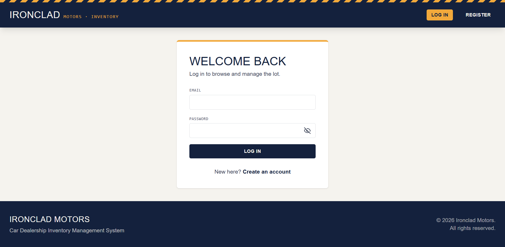
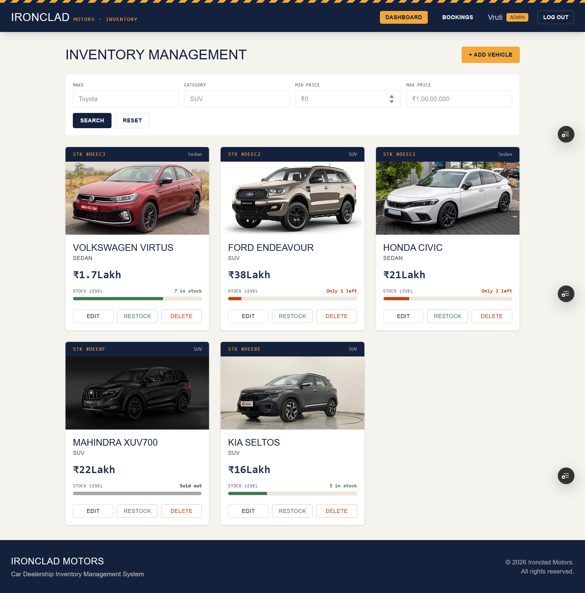
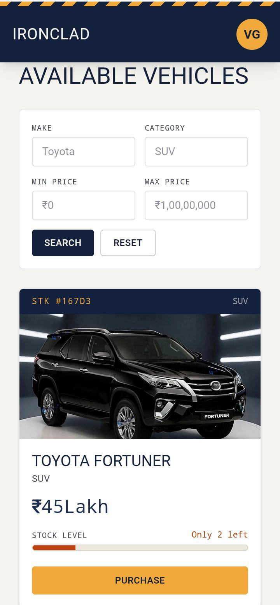

# 🚗 Ironclad Motors  
# Car Dealership Inventory Management System

<p align="center">


</p>

<p align="center">
  A modern full-stack vehicle inventory and dealership management platform  
  built with MERN stack featuring authentication, inventory management, bookings,
  email confirmation and a fully responsive mobile-first interface.
</p>


---

# 🚘 Overview

**Ironclad Motors** is a MERN-stack Car Dealership Inventory Management System designed to provide a seamless experience for both customers and dealership administrators.

Customers can browse available vehicles, search inventory, purchase vehicles and track their bookings.

Administrators get a powerful dashboard to manage vehicle inventory, update stock, upload images and monitor customer bookings.

The application is optimized for **desktop, tablet and mobile devices** with a modern responsive UI.


---

---

# 🌐 Live Demo

Experience the application without any local setup.

## 🚀 Frontend (Vercel)

**Live Website:**  
👉 **https://car-dealership-inventory-system-plum.vercel.app/**

## ⚙️ Backend API (Render)

**REST API:**  
👉 **https://car-dealership-inventory-system-xz8y.onrender.com**

> **Note**
>
> The backend is hosted on **Render's free tier**. If the API has been inactive for several minutes, the first request may take **30–60 seconds** while the server wakes up. After that, requests respond normally.

---

# ✨ Features


## 👤 Customer Features

✅ User registration and login  
✅ JWT based authentication  
✅ Browse available vehicles  
✅ Search vehicles by:
- Make
- Category
- Price range

✅ Vehicle purchase workflow  
✅ Auto-filled customer details during purchase  
✅ Booking confirmation page  
✅ View personal booking history  
✅ Responsive mobile dashboard  


---

## 👨‍💼 Admin Features

✅ Admin authentication  
✅ Dedicated admin dashboard  
✅ Add new vehicles  
✅ Edit vehicle information  
✅ Delete vehicles  
✅ Upload vehicle images  
✅ Manage stock quantity  
✅ Restock vehicles  
✅ View all customer bookings  
✅ Responsive admin panel  


---

# 📱 Responsive Mobile Experience


The application is designed with a mobile-first approach.

### Mobile improvements:

✅ Responsive navigation  
✅ Compact user profile display  
✅ Mobile friendly dashboards  
✅ Responsive vehicle cards  
✅ Optimized booking forms  
✅ Scrollable booking tables  
✅ Touch-friendly buttons  
✅ Adaptive layouts for small screens  


Desktop:

```
Dashboard
---------------------------------
Navbar | Vehicles | Admin Panel
---------------------------------
```


Mobile:

```
☰

Ironclad Motors

Vehicles

Bookings

Profile
```

---

# 🎨 UI Highlights


- Modern dealership inspired design
- Custom color theme
- Smooth hover effects
- Loading animations
- Responsive cards
- Toast notifications
- Clean forms
- Mobile optimized navigation
- Professional dashboard layouts

### ☁️ Cloudinary Image Storage

- Vehicle images are uploaded and stored securely using **Cloudinary**.
- Permanent cloud-hosted image URLs ensure images remain available after server restarts or redeployments.
- Temporary files created during upload are automatically removed after a successful Cloudinary upload.
- Supports **PNG, JPG, JPEG, WEBP, and AVIF** image formats.


---

# 📸 Screenshots


## Login Page




## User Dashboard


## Admin Dashboard




## Mobile View



---

## 🛠 Tech Stack

| Domain | Technology | Description |
| :--- | :--- | :--- |
| **Frontend** | React 18 (Vite) | UI components and rendering |
| | React Router DOM v6 | Client-side routing & navigation |
| | Axios | Interceptor-based HTTP client |
| | Tailwind CSS | Utility-first responsive styling |
| | Context API | Global state management (Auth, Toasts) |
| **Backend** | Node.js & Express.js | Event-driven runtime & RESTful API framework |
| | MongoDB & Mongoose | Document database & Object Data Modeling (ODM) |
| | JWT & bcrypt | Stateless token auth & secure password hashing |
| | Multer | Multipart/form-data media processing |
| **Testing** | Jest & Supertest | Comprehensive unit & end-to-end API testing |

---

## 🏗 System Architecture

```text
               ┌────────────────────────┐
               │    React 18 Frontend   │
               └───────────┬────────────┘
                           │ Axios (HTTP + Auth Interceptors)
                           ▼
               ┌────────────────────────┐
               │   Express REST API     │
               └───────────┬────────────┘
                           │ Auth & Admin Middlewares
                           ▼
               ┌────────────────────────┐
               │   Controller Layer     │ (Req Validation)
               └───────────┬────────────┘
                           │
                           ▼
               ┌────────────────────────┐
               │     Service Layer      │ (Business Logic)
               └───────────┬────────────┘
                           │
                           ▼
               ┌────────────────────────┐
               │    MongoDB Database    │ (Mongoose Models)
               └───────────┬────────────┘
```

> **Data Flow:** Incoming request vectors pass through central authentication and authorization gates (`authMiddleware`, `adminMiddleware`). Lightweight controllers parse and validate inputs before passing execution to dedicated **Services**. The service layer owns the domain logic, ensuring complete decoupling from HTTP transports.

---

## 📁 Project Structure

# 📁 Project Structure

```text
🚗 car-dealership-inventory-system
│
├── 📂 backend
│   │
│   ├── 📂 config
│   │   └── database.js              # MongoDB connection setup
│   │
│   ├── 📂 controllers                # Request handling logic
│   │   ├── authController.js
│   │   ├── vehicleController.js
│   │   └── bookingController.js
│   │
│   ├── 📂 middleware                 # Security & validation layer
│   │   ├── authMiddleware.js
│   │   ├── adminMiddleware.js
│   │   ├── uploadMiddleware.js
│   │   ├── validators.js
│   │   └── errorHandler.js
│   │
│   ├── 📂 models                     # Database schemas
│   │   ├── User.js
│   │   ├── Vehicle.js
│   │   └── Booking.js
│   │
│   ├── 📂 routes                     # REST API routes
│   │   ├── authRoutes.js
│   │   ├── vehicleRoutes.js
│   │   └── bookingRoutes.js
│   │
│   ├── 📂 services                   # Business logic layer
│   │   ├── vehicleService.js
│   │   └── bookingService.js
│   │
│   ├── 📂 utils                      # Reusable helper functions
│   │   ├── generateToken.js
│   │   ├── checkVehicleStock.js
│   │   └── updateVehicleQuantity.js
│   │
│   ├── 📂 tests                      # Jest + Supertest tests
│   │   ├── auth.test.js
│   │   ├── vehicle.test.js
│   │   └── booking.test.js
│   │
│   ├── 📂 uploads                    # Vehicle images
│   │
│   ├── app.js                        # Express configuration
│   ├── server.js                     # Server entry point
│   ├── seed.js                       # Demo data generator
│   └── package.json
│
│
├── 📂 frontend
│   │
│   ├── 📂 src
│   │   │
│   │   ├── 📂 components             # Reusable UI components
│   │   │   ├── Navbar.jsx
│   │   │   ├── Footer.jsx
│   │   │   ├── VehicleCard.jsx
│   │   │   ├── VehicleForm.jsx
│   │   │   ├── SearchBar.jsx
│   │   │   ├── StockGauge.jsx
│   │   │   └── ProtectedRoute.jsx
│   │   │
│   │   ├── 📂 pages                  # Application screens
│   │   │   ├── Login.jsx
│   │   │   ├── Register.jsx
│   │   │   ├── UserDashboard.jsx
│   │   │   ├── AdminDashboard.jsx
│   │   │   ├── MyBookings.jsx
│   │   │   └── AdminBookings.jsx
│   │   │
│   │   ├── 📂 context                # Global state management
│   │   │   ├── AuthContext.jsx
│   │   │   └── ToastContext.jsx
│   │   │
│   │   ├── 📂 services                # API communication
│   │   │   ├── api.js
│   │   │   └── vehicleService.js
│   │   │
│   │   ├── 📂 utils                   # Frontend helpers
│   │   │   └── formatCurrency.js
│   │   │
│   │   ├── App.jsx                    # Route configuration
│   │   └── main.jsx                   # React entry point
│   │
│   ├── public
│   ├── package.json
│   └── vite.config.js
│
│
├── 📄 README.md                       # Documentation
├── 📄 PROMPTS.md                      # Development notes
└── 📄 .gitignore

```

---

## 📡 API Reference

All protected endpoints require a valid bearer token passed via header:  
`Authorization: Bearer <JWT_TOKEN>`

### 🔑 Authentication Routes
| Method | Endpoint | Access | Purpose |
| :--- | :--- | :--- | :--- |
| `POST` | `/api/auth/register` | Public | Register new user (*Customer/Admin*) |
| `POST` | `/api/auth/login` | Public | Authenticate credentials & return JWT |

### 🚗 Vehicle Routes
| Method | Endpoint | Access | Purpose |
| :--- | :--- | :--- | :--- |
| `GET` | `/api/vehicles` | Protected | Fetch complete active vehicle catalog |
| `GET` | `/api/vehicles/search` | Protected | Filter by `make`, `category`, `minPrice`, `maxPrice` |
| `POST` | `/api/vehicles` | Admin | Create vehicle record (Supports image upload) |
| `PUT` | `/api/vehicles/:id` | Admin | Update vehicle metadata/image |
| `DELETE` | `/api/vehicles/:id` | Admin | Remove vehicle record from inventory |

### 📦 Orders & Inventory Routes
| Method | Endpoint | Access | Purpose |
| :--- | :--- | :--- | :--- |
| `POST` | `/api/vehicles/:id/purchase` | Protected | Process order, lower stock count & save booking |
| `POST` | `/api/vehicles/:id/restock` | Admin | Increment stock quantity for a vehicle |
| `GET` | `/api/bookings/my` | Protected | Retrieve authenticated user's order history |
| `GET` | `/api/bookings` | Admin | Fetch system-wide purchase logs |

## Booking

| Method | Endpoint | Description |
|-|-|-|
| POST | /api/vehicles/:id/purchase | Purchase vehicle |
| GET | /api/bookings/my | User bookings |
| GET | /api/bookings | Admin bookings |

---

## ⚙️ Getting Started

### Prerequisites
* **Node.js**: `v18.x` or higher
* **MongoDB**: Local MongoDB instance or active MongoDB Atlas URI

### 1️⃣ Clone Repository
```bash
git clone https://github.com/vrutigadhiya/car-dealership-inventory-system
cd car-dealership-inventory-system
```

### 2️⃣ Backend Configuration
```bash
cd backend
npm install
```

Create a `.env` file in the `backend/` directory:
```env
PORT=5000
MONGO_URI=mongodb://localhost:27017/car-dealership
JWT_SECRET=your_super_secret_jwt_key
JWT_EXPIRES_IN=1h
CLOUDINARY_CLOUD_NAME=your_cloufinary_cloud_name
CLOUDINARY_API_KEY=your_cloudnary_api_key
CLOUDINARY_API_SECRET=your_cloundinary_api_secret
```

Launch the backend development server:
```bash
npm run dev
```

### 3️⃣ Frontend Configuration
```bash
# In a new terminal tab:
cd frontend
npm install
```

Create a `.env` file in the `frontend/` directory:
```env
VITE_API_BASE_URL=http://localhost:5000/api
```

Launch the frontend web app:
```bash
npm run dev
```
> The application will be running live at `http://localhost:5173`.

### 4️⃣ Seed Demo Data *(Optional)*
Populate your database with mock vehicles and administrative accounts:
```bash
cd backend
node seed.js
```

---
## Testing

| Tool | Usage |
|-|-|
| Jest | Unit Testing |
| Supertest | API Testing |

# 🔐 Authentication System


Implemented using:

- JWT Authentication
- Protected Routes
- Role Based Authorization


# 👥 Role-Based Access Control

The Car Dealership Inventory Management System uses **Role-Based Access Control (RBAC)** to provide different permissions for **Users** and **Administrators**.

---

## 👤 User Permissions

Users can:

* 🔍 Browse available vehicles
* 🚗 View vehicle details
* 🛒 Purchase available vehicles
* 📦 View booking history
* 👤 Manage their profile

Users cannot:

* ❌ Add vehicles
* ❌ Edit vehicle details
* ❌ Delete vehicles
* ❌ Restock inventory
* ❌ Access the admin dashboard

---

## 🛠️ Administrator Permissions

Administrators can:

* ➕ Add new vehicles with images and specifications
* ✏️ Edit vehicle details
* 🗑️ Delete vehicles
* 📦 Restock vehicle inventory
* 📊 Access the admin dashboard
* 📋 Manage vehicle inventory

---

🔐 Administrator Authority

Each vehicle is associated with the administrator who created it. This ensures that every administrator is responsible only for their own vehicle listings. Administrators can edit, delete, and restock only the vehicles they have added, while vehicles added by other administrators remain not viewable and cannot be managed by them.


## 🧪 Testing Suite (TDD)

This project strictly adheres to **Test-Driven Development (TDD)** principles following the **Red-Green-Refactor** cycle. Core API integration tests cover happy paths, authorization guards, data validation errors, and DB edge cases.

```bash
cd backend

# Execute all test suites
npm test

# Run Jest in watch mode during development
npx jest --watch

# Generate code coverage reports
npx jest --coverage
```

Coverage outputs will be generated directly inside `backend/coverage/`.

---

## 🤖 AI Pairing & Methodology

### Copilot & AI Collaboration
This system was developed using **Claude (Anthropic)** acting as an automated pair programmer. 

#### TDD Workflow Execution
1. 🔴 **Red Phase:** Asked Claude to write exhaustive, intentionally failing integration tests covering edge cases (*out-of-stock purchases, invalid ObjectIDs, non-admin access blocks*) before writing production logic.
2. 🟢 **Green Phase:** Wrote minimal backend code required to satisfy all Jest test suites.
3. 🔁 **Refactor Phase:** Used AI feedback to clean code into a clean, decoupled Controller-Service pattern and introduce global exception-handling middleware.

#### Commit Hygiene Example
Commits engineered through collaborative AI pairing include standard trailing metadata:

```text
test: add vehicle purchase endpoint tests (red-green-refactor)

Used an AI assistant to draft the test suite covering successful
purchase, out-of-stock rejection, and invalid vehicle ID handling.

Co-authored-by: ChatGPT Claude <noreply@anthropic.com>
```

#### Reflection
Using AI as an intelligent TDD pair-programmer dramatically reduced boilerplate generation and edge-case oversight. Architectural decisions, system validation, state management choices, and final code verifications remained strictly human-driven.

---

# 🚀 Future Improvements


- Online payment integration
- Vehicle comparison feature
- Customer reviews
- Advanced analytics dashboard
- AI based vehicle recommendation
- Cloud image storage
- Push notifications
- Confirmation Email
